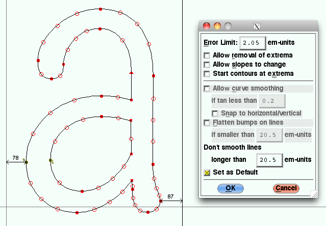
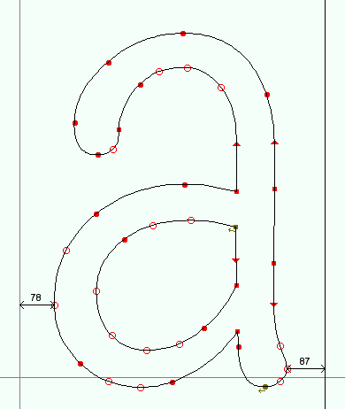

# Introduction

_Tutorial on generating font files for basic web use, using Fontlab and Fontforge._

This document by Dave Crossland (dave@understandinglimited.com) describes how to prepare and generate a font file for basic web use using Fontlab and Fontforge.

The other page, HowToGenerateWebNativeFonts, explains how to create a PS/OpenType-CFF font. 
You can use FontForge to convert this into a TrueType font suitable for use on the web.

If you are hand-hinting the fonts, this will be done with your hinting tools, and you will create a final TTF that is named Font-Regular.ttf and also have source files such as Font-Regular-TTF.vfb or Font-Regular-TTF-VTT.ttf or whatever files you personally saved when working on the hinting. 
This is important so that if someone makes a change in the original drawing files, they can easily bring that change through the rest of the build process.

  1. Open the OTF in FontForge
  1. Go to Element, Font Info, Layers, and set 'All layers Quadratic'
  1. in Grid Fitting, set Version to 1 and click &lt;New&gt;
  1. Hit the backspace key to delete the 0 and type in 65535 then click all 4 options and turn them on and click OK
  1. Go to Edit, Select, Select All
  1. Go to Element, Simplify, Simplify More and turn everything off except 'set as default' and click OK.   This is important because it reduces filesize. In this example:
```
Pompiere original:   58,632
Pompiere simplified: 48,620
Saving:              10,012 bytes - 20% of the file size! :)
```
  1. Go to Hints, Edit prep, and click Edit
  1. Click the edit window so there is a flashing caret inside the "TrueType Instructions for 'prep'" window
  1. Go to this page and select and copy this magic code:
```
PUSHW_1
 511
SCANCTRL
PUSHB_1
 4
SCANTYPE
```
  1. Go back to FontForge's "TrueType Instructions for 'prep'" window and hit the CTRL-V keyboard shortcut key to paste in the code and click OK
  1. Go to File, Save As, name the file FontnameSansOne-Regular-TTF.sfd and click Save
  1. Go to File, Generate, and click the 'up directory' icon, and name the file FontnameSansOne-Regular.ttf
  1. Set the font format dropdown to TrueType and set No Bitmap Fonts and No Rename, and uncheck the 3 options.
  1. Click Options and tick 'PS Glyph Name' 'OpenType' and 'Dummy DSIG' and untick everything else, click OK and then click Save

Now find a Windows machine with Firefox 4+ installed, and visit http://impallari.com/testing/ and drag and drop all the fonts into the grey bar at the top. 
Using the Windows Control Panel, you can toggle ClearType on and off to see the differences.

The best thing will be to have the font hand hinted, but these magic hinting settings provide a stop gap until that can happen.